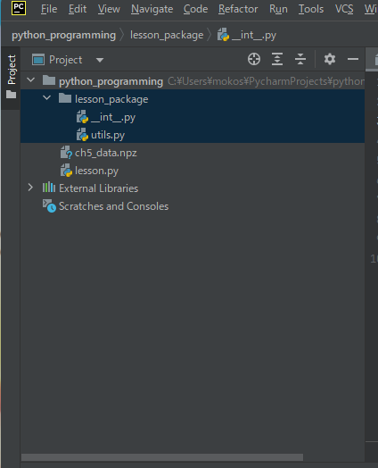
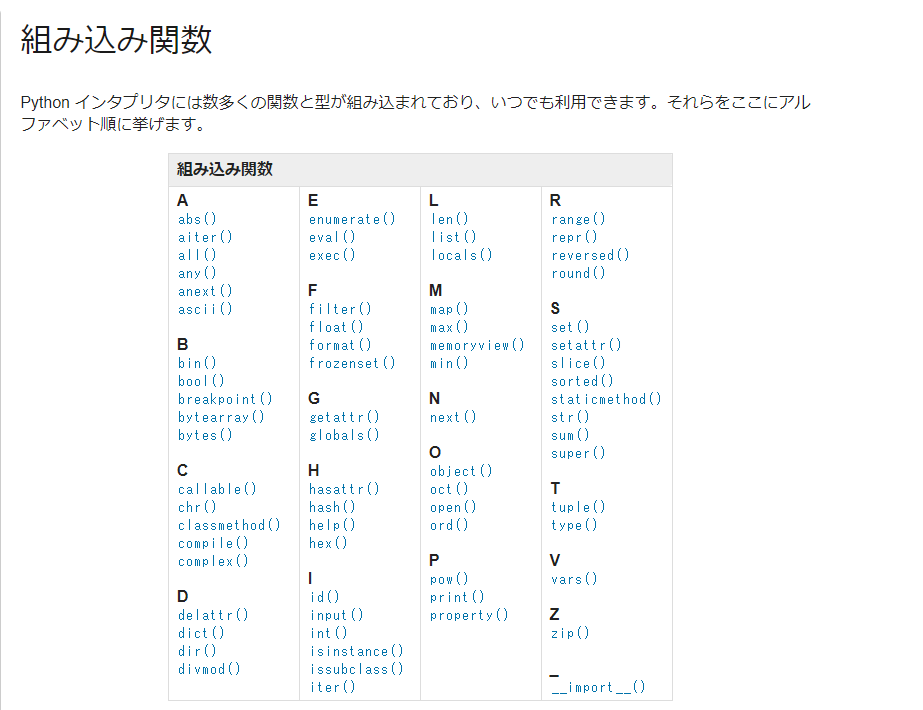
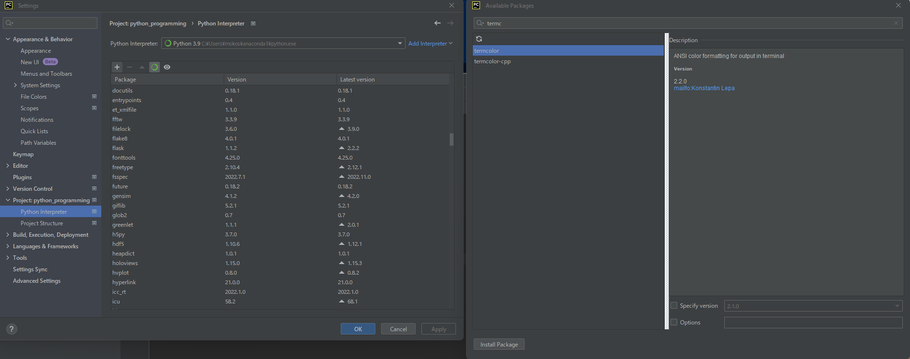

## 67. コマンドライン引数

PyCharmだと、Edit COnfigurationsから、parametersに引数を入力できる。
```python
import sys

print(sys.argv)

print('')

for i in sys.argv:
    print(i)


C:\Users\mokos\PycharmProjects\python_programming\13.py
arg1
arg2

Process finished with exit code 0

```

terminal だと、linuxのように、記述することで、コマンドライン引数を渡すことができる。
```
(base) PS C:\Users\mokos\PycharmProjects\python_programming> python 13.py op1 op2 op3  
['13.py', 'op1', 'op2', 'op3']

13.py
op1
op2
op3
(base) PS C:\Users\mokos\PycharmProjects\python_programming>

```

## 68. Import文とAS
モジュールのディレクトリ構造は以下。  
lesson_packageというフォルダを作成し、そのなかに、\_\_init__.py,utils.pyを作成した。  
\_\_init__.pyの中は今は空。  


```python
# lesson.py
# importは3種類ほどある
#import lesson_package.utils
#from lesson_package import utils
from lesson_package.utils import say_twice # あまり使わない。関数のみだと、どこからの関数かわかりにくくなる。
from lesson_package.talk import human

#r = lesson_package.utils.say_twice('hello')
#r = utils.say_twice('hello')
r = say_twice('hello')
print(r)

print(human.sing())
print(human.cry())
```

```python
# utils.py
def say_twice(word):
    return (word + '!') * 2
```

```python
# human.py
from lesson_package.tools import utils
from ..tools import utils


def sing():
    return 'sing'

def cry():
    return utils.say_twice('cry')
```

## 69. 絶対パスと相対パスのImport
```python
# human.py
from lesson_package.tools import utils
from ..tools import utils


def sing():
    return 'sing'

def cry():
    return utils.say_twice('cry')
```


## 70. アスタリスクのインポートと__init__.pyと__all__
```python
#lesson_package/lesson.py
# *でインポートするときは、talkフォルダ内にある、__init__.pyが読み込まれる。
from lesson_package.talk import *

print(animal.sing())
print(animal.cry())
```

```python
#lesson_package/talk/__init__.py
__all__ = ['animal', 'human']

#lesson_package/talk/animal.py
from lesson_package.tools import utils
from ..tools import utils

def sing():
    return 'wowowowow!'

def cry():
    return utils.say_twice('cry')

#lesson_package/talk/human.py
from lesson_package.tools import utils
from ..tools import utils

def sing():
    return 'sing'

def cry():
    return utils.say_twice('cry')

#lesson_pakage/tools/utils.py
def say_twice(word):
    return (word + '!') * 2
```

## 71. ImportErrorの使いどころ
```python
try:
    from lesson_package import utils
except ImportError:
    from lesson_package.tools import utils

utils.say_twice('word')
```

## 72. setup.pyでパッケージ化して配布する。

```
pycharm のメニューの
Tools -->
    Create setup.py
    を実行

Tools -->
    Run Setup.py Task.. -->
        sdit

を行うと、tar.gzファイルが作成される。

```
コマンドラインからの場合
```
(base) PS C:\Users\mokos\PycharmProjects\python_programming> python setup.py sdist
running sdist
running egg_info
writing python_programming.egg-info\PKG-INFO
writing dependency_links to python_programming.egg-info\dependency_links.txt
writing top-level names to python_programming.egg-info\top_level.txt
reading manifest file 'python_programming.egg-info\SOURCES.txt'
writing manifest file 'python_programming.egg-info\SOURCES.txt'
warning: sdist: standard file not found: should have one of README, README.rst, README.txt, README.md

running check
creating python_programming-20230122
creating python_programming-20230122\lesson_package
creating python_programming-20230122\lesson_package\talk
creating python_programming-20230122\lesson_package\tools
creating python_programming-20230122\python_programming.egg-info
copying files to python_programming-20230122...
copying lesson.py -> python_programming-20230122
copying setup.py -> python_programming-20230122
copying lesson_package\__int__.py -> python_programming-20230122\lesson_package
copying lesson_package\talk\__init__.py -> python_programming-20230122\lesson_package\talk
copying lesson_package\talk\animal.py -> python_programming-20230122\lesson_package\talk
copying lesson_package\talk\human.py -> python_programming-20230122\lesson_package\talk
copying lesson_package\tools\utils.py -> python_programming-20230122\lesson_package\tools
copying python_programming.egg-info\PKG-INFO -> python_programming-20230122\python_programming.egg-info
copying python_programming.egg-info\SOURCES.txt -> python_programming-20230122\python_programming.egg-info
copying python_programming.egg-info\dependency_links.txt -> python_programming-20230122\python_programming.egg-info
copying python_programming.egg-info\top_level.txt -> python_programming-20230122\python_programming.egg-info
Writing python_programming-20230122\setup.cfg
creating dist
Creating tar archive
removing 'python_programming-20230122' (and everything under it)
(base) PS C:\Users\mokos\PycharmProjects\python_programming>
```

## 73. 組み込み関数
```python
# print などの組み込み関数は、builtinsライブラリに存在している。
import builtins

builtins.print('hey')

# 読み込まれるライブラリは以下で確認できる。
print(globals())
```
```
C:\Users\mokos\anaconda3\python.exe C:\Users\mokos\PycharmProjects\python_programming\lesson.py 
{'__name__': '__main__', '__doc__': None, '__package__': None, '__loader__': <_frozen_importlib_external.SourceFileLoader object at 0x000001E258E86D00>, '__spec__': None, '__annotations__': {}, '__builtins__': <module 'builtins' (built-in)>, '__file__': 'C:\\Users\\mokos\\PycharmProjects\\python_programming\\lesson.py', '__cached__': None}

Process finished with exit code 0
```

ドキュメントは以下。
https://docs.python.org/ja/3/library/functions.html



```python
#sorted関数
ranking = {
    'A': 100,
    'B': 85,
    'C': 95
}

for key in ranking:
    print(key)

print(sorted(ranking, key=ranking.get, reverse=True))
```

## 74. 標準ライブラリ

ドキュメントは以下。
https://docs.python.org/ja/3/library/index.html  

```python
s = "fjoaidjiouihuhfghjfgfkjhgdfrtyqqeppkhfxxxoghaadfasdfklajeiofhasdg"

d = {}
for c in s:
    if c not in d: # sの一文字例えばfがdのkeyになければ、d[c] = 0 (d[f] = 0)を代入する。
        d[c] = 0
    d[c] += 1
print(d)

d = {}
for c in s:
    d.setdefault(c, 0) # key c がない場合、valueに0を代入するという意味。
    d[c] += 1
print(d)

from collections import defaultdict

d = defaultdict(int)
print('defaultdict(int) : ', d)
for c in s:
    d[c] += 1
print(d)

```

```
C:\Users\mokos\anaconda3\python.exe C:\Users\mokos\PycharmProjects\python_programming\lesson.py 
{'f': 9, 'j': 5, 'o': 4, 'a': 6, 'i': 4, 'd': 5, 'u': 2, 'h': 7, 'g': 5, 'k': 3, 'r': 1, 't': 1, 'y': 1, 'q': 2, 'e': 2, 'p': 2, 'x': 3, 's': 2, 'l': 1}
{'f': 9, 'j': 5, 'o': 4, 'a': 6, 'i': 4, 'd': 5, 'u': 2, 'h': 7, 'g': 5, 'k': 3, 'r': 1, 't': 1, 'y': 1, 'q': 2, 'e': 2, 'p': 2, 'x': 3, 's': 2, 'l': 1}
defaultdict(int) :  defaultdict(<class 'int'>, {})
defaultdict(<class 'int'>, {'f': 9, 'j': 5, 'o': 4, 'a': 6, 'i': 4, 'd': 5, 'u': 2, 'h': 7, 'g': 5, 'k': 3, 'r': 1, 't': 1, 'y': 1, 'q': 2, 'e': 2, 'p': 2, 'x': 3, 's': 2, 'l': 1})

Process finished with exit code 0
```

## 75. サードパーティーのライブラリ
https://pypi.org/

pycharmでサードパーティーのパッケージをインストールする方法


コマンドラインの場合
```
(base) PS C:\Users\mokos\PycharmProjects\python_programming> pip install termcolor
Requirement already satisfied: termcolor in c:\users\mokos\anaconda3\lib\site-packages (2.1.0)
(base) PS C:\Users\mokos\PycharmProjects\python_programming> 
```

```python
# sample

# from termcolor import colored
# print('test')
#
# print(colored('test', 'red'))
#
# print(help(colored))

import sys

from termcolor import colored, cprint

text = colored("Hello, World!", "red", attrs=["reverse", "blink"])
print(text)
cprint("Hello, World!", "green", "on_red")

print_red_on_cyan = lambda x: cprint(x, "red", "on_cyan")
print_red_on_cyan("Hello, World!")
print_red_on_cyan("Hello, Universe!")

for i in range(10):
    cprint(i, "magenta", end=" ")

cprint("Attention!", "red", attrs=["bold"], file=sys.stderr)
```
## 76. importする際の記述の仕方
```python
# 標準ライブラリ
import collections, sys
import os
import sys
# 標準ライブラリとサードパーティーのライブラリの間にスペースを開ける。
# サードパーティー
import termcolor

# ローカルファイル
import lesson_pakage

import config

print(collections.__file__)
print(termcolor.__file__)
print(lesson_package.__file__)
print(config.__file__)

print(sys.path)
```

## 77. \_\_name__と__main__
```python
# lesson.py
import lesson_package.talk.animal
import config


def main():
    lesson_package.talk.animal.sing()
    print(__name__)

if __name__ == '__main__':
    main()


# config.py
print('config:', __name__)

# animal.py
# from lesson_package.tools import utils
from ..tools import utils


def sing():
    return 'wowowowow!'

def cry():
    return utils.say_twice('cry')

if __name__ == '__main__':
    print(sing())
    print('animal:', __name__)
```
