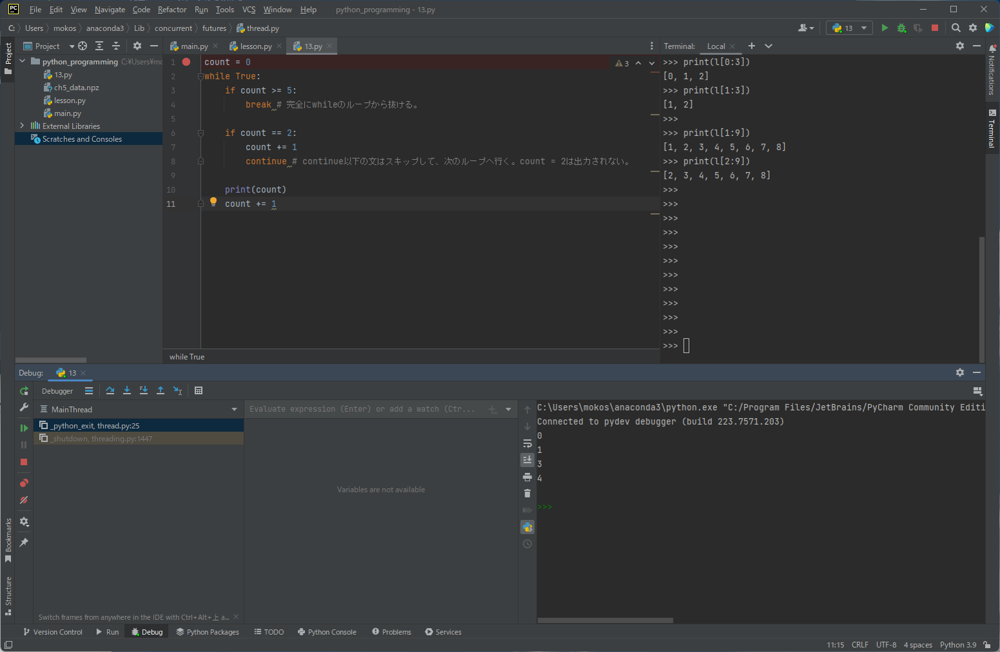

## if文
```python
x = -10
if x < 0:
    print('negative')

else:
    print('positive')

if x < 0:
    print('negative')
elif x == 0:
    print('zero')
elif x == 10:
    print('10')
else:
    print('positive')

a = 5
b = 10

if a > 0:
    print('a is positive')
    if b > 0:
        print('b is positive')
```

## デバッカーを使用して確認してみる
コードの右側をクリックし、breakポイントを付ける。  
画面右上の緑の虫ボタンをクリックする。  
F7を押して、プログラムを進める。  



## 比較演算子と論理演算子
```python
# var
a = 1
b = 10
c = -10

# aとbが等しい。
if a == b:
    print('a == b')

# aがbと異なる
if a != b:
    print('a != b')

# aがbよりも小さい
if a < b:
    print('a < b')

# aがbよりも大きい
if a > b:
    print('a > b')

# aがb以下である
if a <= b:
    print('a <= b')

# aがb以上である
if a >= b:
    print('a >= b')

# 共通部分
if a > 0 and b > 0:
    print('a > 0 and b > 0')

# 和集合
if a > 0 or b > 0:
    print('a > 0 or b > 0')
else:
    print('a < 0 or b < 0')
```

## In と Notの使いどころ
```python
y = [1, 2, 3]
x = 1

if x in y:
    print('in')

if 100 not in y:
    print('not in')

a = 1
b = 2

# あまり使わない
if not a == b:
    print('Not equal')
# こちらの方を使う
if a != b:
    print('Not equal')


is_ok = True

# ブーリアン型の場合、ifの後にその変数を書くだけでよい。( if is_ok == True: という書き方をしなくて良い。)
if is_ok:
    print('hello')

if not is_ok:
    print('not hello')
```


## 値が入っていない判定をするテクニック
```python
# Falseと判定されるもの
# 0, 0.0, '', [], (), {}, set()

is_ok = True
is_ok = 1
is_ok = ''
is_ok = 'abc'
is_ok = []
is_ok = [1]


if is_ok:
    print('OK')
else:
    print('NO')
```

## Noneを判定する場合
```python
is_empty = None
print(is_empty)
print(help(is_empty))

# あまり使わない。
if is_empty == None:
    print('None!!')

# 以下を使う。
if is_empty is None:
    print('None!!')

if is_empty is not None:
    print('Not None!!')

print(1 == True)
print(1 is True)
print(True is True)
print(None is None)
```

## while文とcontunue文とbreak文
```python
count = 0
while count < 5:
    print(count)
    count += 1 # count = count + 1

count = 0
while True:
    if count >= 5:
        break
    print(count)
    count += 1

count = 0
while True:
    if count >= 5:
        break # 完全にwhileのループから抜ける。

    if count == 2:
        count += 1
        continue # continue以下の文はスキップして、次のループへ行く。count = 2は出力されない。

    print(count)
    count += 1
```

## while else文
```python
count = 0

while count < 5:
    if count == 1:
        break
    print(count)
    count += 1
else: # while内で、breakで抜けなければ、elseが実行される。
    print('done')

```
## input関数
```python
while True:
    word = input('Enter:')
    if word == 'ok':
        break
    print('next')

while True:
    word = input('Enter:')
    num = int(word)
    if num == '100':
        break
    print('next')
```

## for文とbreak文とcontinue文
```python
some_list = [1, 2, 3, 4, 5]

i = 0
while i < len(some_list):
    print(some_list[i])
    i += 1

for i in some_list:
    print(i)


for s in 'abcde':
    print(s)

for word in ['My', 'name', 'is', 'Mike']:
    if word == 'name':
        # break [word == 'name'なら、forループが終了]
        # continue [word == 'name'なら、print(word)がスキップされ、次のループへ。]
    print(word)
```

## for else文
```python
for fruit in ['apple', 'banana', 'orange']:
    # if fruit == 'banana':
    #    print('stop eating')
    # break #breakはforループすべてから抜ける。elseは実行されない。
    print(fruit)
else:
    print('I ate all!')
```

## range関数
```python
for i in range(10):
    print(i) # 0~9

for i in range(2, 10):
    print(i) # 2~9

for i in range(2, 10, 2)
    print(i) # 2,4,6,8

for _ in range(10): # for内で、インデックスを使用しない時は、アンダースコアを使用する。
    print('hello')
```
## enumerate関数
```python
i = 0
for fruit in ['apple', 'banana', 'orange']:
    print(i, fruit)
    i +=1

i = 0
for i, fruit in enumerate(['apple', 'banana', 'orange']):
    print(i, fruit)
```

## zip関数
```python
days = ['Mon', 'Tue', 'Wed']
fruits = ['apple', 'banana', 'orange']
drinks = ['coffee', 'tea', 'beer']

for i in range(len(days)):
    print(days[i], fruits[i], drinks[i])


for day, fruit, drink in zip(days, fruits, drinks):
    print(day, fruit, drink)
```

## 辞書をfor文で処理する
```python
d = {'x': 100, 'y': 200}

for v in d:
    print(v)

for k, v in d.items():
    print(k, ':', v)

d = {'x': 100, 'y': 200}
print(d.items())

# dict_items([('x', 100), ('y', 200)])
# listの中にtaple
# それぞれの周でtapleのアンパッキングで、k, vの変数に入れられる。
```


## 関数定義
```python

def say_something():
    print('hi')

say_something()

print(type(say_something))

def say_somethong():
    s = 'hi'
    return s

result = say_something()
print(result)

def what_is_this(color):
    print(color)

what_is_this('red')

def what_is_this(color):
    if color == 'red':
        return 'tomato'
    elif color == 'green':
        return 'green pepper'
    else:
        return "I don't know"
    print(color)

result = what_is_this('red')
print(result)
```


## 関数の引数と返り値の宣言
```python
num: int = 10

def add_num(a: int, b: int) -> int:
    return a + b

r = add_num(10, 20)
print(r)

r = add_num('a', 'b') # stringを渡しても実行できてしまう。
print(r)
```
## 位置引数とキーワード引数とデフォルト引数
```python
def menu(entree, drink, dessert): 
    # print(entree, drink, dessert)
    print('entree = ', entree)
    print('drink = ', drink)
    print('dessert = ', dessert)

menu('beef', 'ice', 'ice')　# 位置引数。関数で定義した順番に、引数として渡される。
menu(entree='beef', dessert='ice', drink='ice') # キーワード引数。キーワードで指定したものが引数として渡される。

def menu(entree='beef', drink='wine', dessert='ice'): # デフォルト引数。
    # print(entree, drink, dessert)
    print('entree = ', entree)
    print('drink = ', drink)
    print('dessert = ', dessert)

menu()
menu(entree='chicken', drink='beer')
menu('chicken', drink='beer')

```

## デフォルト引数で気を付けること
```python
def test_func(x, l=[]): 
    l.append(x)
    return l

y = [1, 2, 3]
r = test_func(100, y)
print(r)

y = [1, 2, 3]
r = test_func(200, y)
print(r)


# リストはデフォルト引数で渡すべきではない。空のリストlを指すアドレスは、一度だけ生成される。
# 1回目のtest_funcの実行時は、空のリストに100がappendされるが、
# 2回目はアドレス参照により、既に100が格納された、リストlが参照される。
# そのため、[100, 100]というリストになってしまう。
r = test_func(100)
print(r)

r = test_func(100) 
print(r)

[100]
[100, 100]

# 空のリストなどを使用したい場合は、以下のようにする。
def test_func(x, l=None): 
    if l is None:
        l = []
    l.append(x)
    return l

r = test_func(100)
print(r)

r = test_func(100) 
print(r)

[100]
[100]
```


## 位置引数のタプル化

## キーワード引数の辞書化

## Docstringsとは

## 関数内関数

## クロージャー

## デコレーター

## ラムダ

## ジェネレーター

## リスト内包表記

## 辞書包括表記

## 集合包括表記

## ジェネレーター内包表記

## 名前空間とスコープ

## 例外処理

## 独自例外の作成