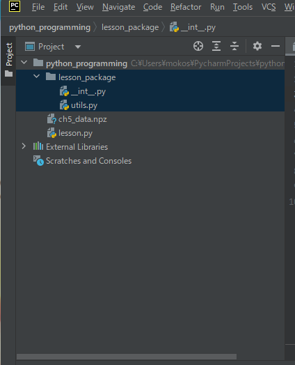

## 67. コマンドライン引数

PyCharmだと、Edit COnfigurationsから、parametersに引数を入力できる。
```python
import sys

print(sys.argv)

print('')

for i in sys.argv:
    print(i)


C:\Users\mokos\PycharmProjects\python_programming\13.py
arg1
arg2

Process finished with exit code 0

```

terminal だと、linuxのように、記述することで、コマンドライン引数を渡すことができる。
```
(base) PS C:\Users\mokos\PycharmProjects\python_programming> python 13.py op1 op2 op3  
['13.py', 'op1', 'op2', 'op3']

13.py
op1
op2
op3
(base) PS C:\Users\mokos\PycharmProjects\python_programming>

```

## 68. Import文とAS
モジュールのディレクトリ構造は以下。  
lesson_packageというフォルダを作成し、そのなかに、\_\_init__.py,utils.pyを作成した。  
\_\_init__.pyの中は今は空。  


```python
# lesson.py
# importは3種類ほどある
#import lesson_package.utils
#from lesson_package import utils
from lesson_package.utils import say_twice # あまり使わない。関数のみだと、どこからの関数かわかりにくくなる。
from lesson_package.talk import human

#r = lesson_package.utils.say_twice('hello')
#r = utils.say_twice('hello')
r = say_twice('hello')
print(r)

print(human.sing())
print(human.cry())
```

```python
# utils.py
def say_twice(word):
    return (word + '!') * 2
```

```python
# human.py
from lesson_package.tools import utils
from ..tools import utils


def sing():
    return 'sing'

def cry():
    return utils.say_twice('cry')
```

## 69. 絶対パスと相対パスのImport

## 70. アスタリスクのインポートと__init__.pyと__all__

## 71. ImportErrorの使いどころ

## 72. setup.pyでパッケージ化して配布する。

## 73. 組み込み関数

## 74. 標準ライブラリ

## 75. サードパーティーのライブラリ

## 76. importする際の記述の仕方

## 77. \_\_name__と__main__
